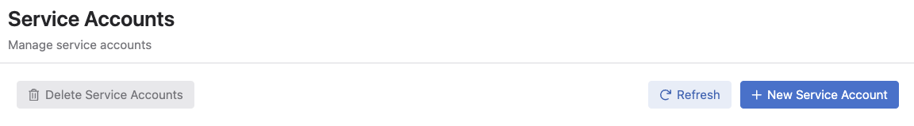
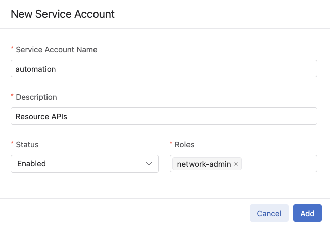
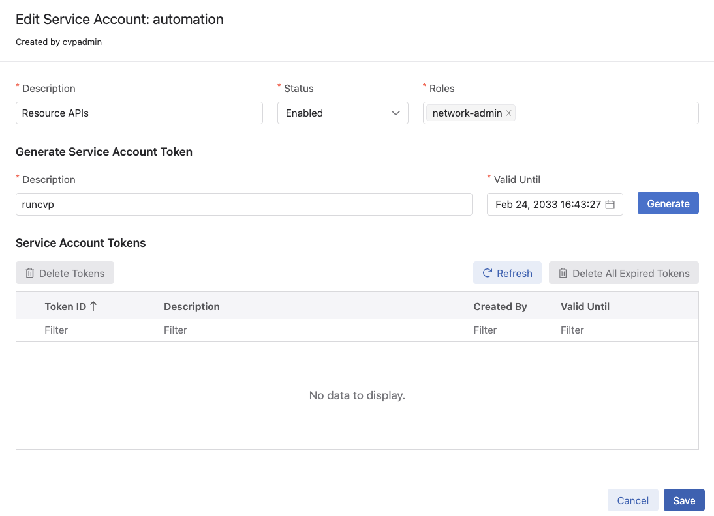
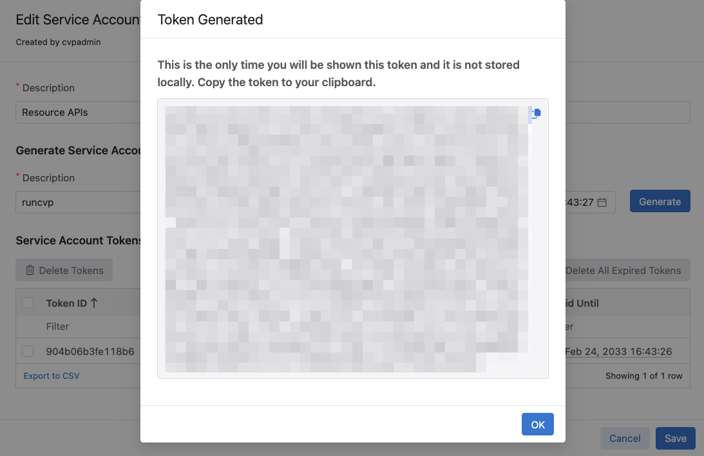

The port used to connect to CVP is 443 for both on-prem and cloud deployments.

## CVaaS URLs

Please note that in case of using CVaaS, the correct regional URL where the CVaaS tenant is deployed must be used.
The following are the cluster URLs used in production:

| Region | URL |
|--------|-----|
| United States 1a | `www.arista.io` |
| United States 1b | `www.cv-prod-us-central1-b.arista.io`|
| United States 1c | `www.cv-prod-us-central1-c.arista.io`|
| Canada | `www.cv-prod-na-northeast1-b.arista.io` |
| Europe West 2| `www.cv-prod-euwest-2.arista.io` |
| Japan| `www.cv-prod-apnortheast-1.arista.io` |
| Australia | `www.cv-prod-ausoutheast-1.arista.io` |
| United Kingdon | `www.cv-prod-uk-1.arista.io` |

{}
URLs without `www` are not supported.
{}

## Authentication

Our APIs currently support token based authentication.

In future releases we intend to support mutual TLS authentication which does not require tokens or login credentials to be stored along with the application.

For more details on gRPC authentication, see: [authentication](https://grpc.io/docs/guides/auth/).

## Token Based Authentication

Tokens can be either received from the HTTP login API (only last for 24 hours) or can be generated on for service accounts (recommended).

Service accounts have been introduced in [2020.3.0](https://www.arista.com/en/support/toi/cvp-2020-3-0/14664-service-accounts) and have been on CVaaS from the beginning.

The steps to create a service account token are (both CV on-prem and CVaaS):

1. Go to Settings
2. Go to Access Control - Service Accounts
3. Create a Service account if there isn't one by clicking on the `+ New Service Account button`

    

4. Fill out the form and click `Add`

    

5. Edit the service account by clicking on it and generate a token

    

    

{}
The service account token will not be retreivable after clicking Ok. It is recommended to store it somewhere safe.
{}

Read on if you are interested in generating a short lived token for CloudVision on-prem using the HTTP login API.

The following examples use `python` but Go, Java, or any other language capable of HTTP requests will work almost identically. To make the HTTP request, we will use the `requests` library which is available through `pip`:

```bash
python -m pip install requests
```

#### Example: token from login (on-prem only)

```python
import requests
import json
import grpc

CV_HOST = "your_cvp_hostname_or_ip"
CV_API_PORT = "443"
USERNAME = "your_cvp_username"
PASSWORD = "your_cvp_password"


r = requests.post('https://' + CV_HOST + '/cvpservice/login/authenticate.do',
  auth=(USERNAME, PASSWORD))

channel_credentials = grpc.ssl_channel_credentials()
call_credentials = grpc.access_token_call_credentials(r.json()['sessionId'])
combined_credentials = grpc.composite_channel_credentials(channel_credentials, call_credentials)
channel = grpc.secure_channel(CV_HOST + ':' + CV_API_PORT, combined_credentials)
```

#### Example: token with loading custom SSL/TLS root certificates

If CVP is using a certificate signed by a certificate authority that is not installed as a root certificate, specify it like so:

```python
import requests
import json
import grpc

CV_HOST = "your_cvp_hostname_or_ip"
CV_API_PORT = "443"
USERNAME = "your_cvp_username"
PASSWORD = "your_cvp_password"

# The certificate authority that signed the CVP certificate.
# If the CVP certificate is self-signed, this is just the certificate itself.
# The default location of CVP's self-signed certificate on a node is /etc/nginx/cvp.crt
CA_PUB_CERT_PATH = "/path/to/ca.pem"

r = requests.post('https://' + CV_HOST + '/cvpservice/login/authenticate.do',
  auth=(USERNAME, PASSWORD),
  verify=CA_PUB_CERT_PATH)

call_credentials = grpc.access_token_call_credentials(r.json()['sessionId'])
with open(CA_PUB_CERT_PATH, 'rb') as cert_file:
  channel_credentials = grpc.ssl_channel_credentials(cert_file.read())
combined_credentials = grpc.composite_channel_credentials(channel_credentials, call_credentials)
channel = grpc.secure_channel(CV_HOST + ':' + CV_API_PORT, combined_credentials)
```

Or download the certificate used by the server. Note that this is insecure.

```python
import requests
import json
import ssl
import tempfile
import grpc

CV_HOST = "your_cvp_hostname_or_ip"
CV_API_PORT = "443"
USERNAME = "your_cvp_username"
PASSWORD = "your_cvp_password"

cert = bytes(ssl.get_server_certificate((CV_HOST, int(CV_API_PORT))))

r = requests.post('https://' + CV_HOST + '/cvpservice/login/authenticate.do',
  auth=(USERNAME, PASSWORD),
  verify=False)

call_credentials = grpc.access_token_call_credentials(r.json()['sessionId'])
channel_credentials = grpc.ssl_channel_credentials(cert)
combined_credentials = grpc.composite_channel_credentials(channel_credentials, call_credentials)
channel = grpc.secure_channel(CV_HOST + ':' + CV_API_PORT, combined_credentials)
```


#### Example: token from file

```python
import grpc

CV_HOST = "your_cvp_hostname_or_ip"
CV_API_PORT = "443"

# The certificate authority that signed the CVP certificate.
# If the CVP certificate is self-signed, this is just the certificate itself.
# The default location of CVP's self-signed certificate on a node is /etc/nginx/cvp.crt
CA_PUB_CERT_PATH = "/path/to/ca.pem"

with open('cloudvision_access_token.txt', 'r') as f:
    call_credentials = grpc.access_token_call_credentials(f.read().strip())
with open(CA_PUB_CERT_PATH, 'rb') as cert_file:
  channel_credentials = grpc.ssl_channel_credentials(cert_file.read())
combined_credentials = grpc.composite_channel_credentials(channel_credentials, call_credentials)
channel = grpc.secure_channel(CV_HOST + ':' + CV_API_PORT, combined_credentials)
```

#### Example: token from environment variable

```python
import grpc

CV_HOST = "your_cvp_hostname_or_ip"
CV_API_PORT = "443"

# The certificate authority that signed the CVP certificate.
# If the CVP certificate is self-signed, this is just the certificate itself.
# The default location of CVP's self-signed certificate on a node is /etc/nginx/cvp.crt
CA_PUB_CERT_PATH = "/path/to/ca.pem"

call_credentials = grpc.access_token_call_credentials(os.environ['CLOUDVISION_ACCESS_TOKEN'])
with open(CA_PUB_CERT_PATH, 'rb') as cert_file:
  channel_credentials = grpc.ssl_channel_credentials(cert_file.read())
combined_credentials = grpc.composite_channel_credentials(channel_credentials, call_credentials)
channel = grpc.secure_channel(CV_HOST + ':' + CV_API_PORT, combined_credentails)
```
