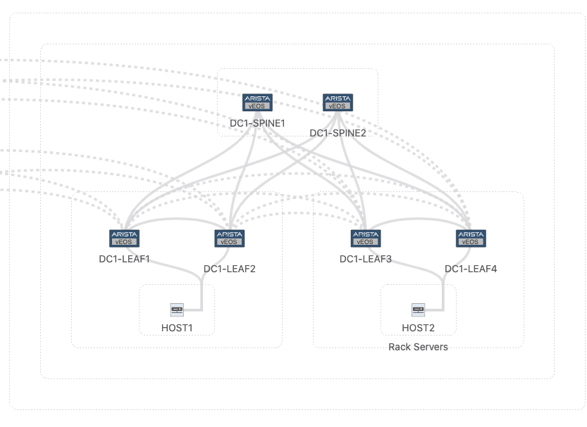

{}

{}
To generate a service account token please refer to the [authentication](../../../connecting/#token-based-authentication) chapter.
{}

{}
[jq](https://stedolan.github.io/jq/) can be used to easily format and parse the outputs.
{}

# Tags

## Tag.v2

The Tag.v2 API is a workspace-aware resource APIs, meaning all changes must be done within a workspace.
Changes only get commited upon submitting the workspace. The following examples will walk through device and interface
tag creation and assignment workflow.

### Get all tags

#### curl

```shell
curl -sS -kX POST --header 'Accept: application/json' -b access_token=`cat token.tok` 'https://192.0.2.100/api/resources/tag/v2/Tag/all' -d '{"partialEqFilter": [{"key":{"workspace_id":""}}]}'
```

Result:

```Javascript
{"result":{"value":{"key":{"workspaceId":"","elementType":"ELEMENT_TYPE_DEVICE","label":"bgp","value":"disabled"}},"time":"2021-08-31T12:13:02.196521931Z","type":"INITIAL"}}
{"result":{"value":{"key":{"workspaceId":"","elementType":"ELEMENT_TYPE_DEVICE","label":"bgp","value":"enabled"}},"time":"2021-08-14T07:26:29.341574116Z","type":"INITIAL"}}
{"result":{"value":{"key":{"workspaceId":"","elementType":"ELEMENT_TYPE_DEVICE","label":"eos","value":"4.23.3M"}},"time":"2021-07-28T02:59:00.766193431Z","type":"INITIAL"}}
{"result":{"value":{"key":{"workspaceId":"","elementType":"ELEMENT_TYPE_DEVICE","label":"eos","value":"4.23.5M"}},"time":"2021-08-14T07:26:27.413625640Z","type":"INITIAL"}}
{"result":{"value":{"key":{"workspaceId":"","elementType":"ELEMENT_TYPE_DEVICE","label":"eos","value":"4.25.0F"}},"time":"2021-09-01T17:15:37.885129346Z","type":"INITIAL"}}
{"result":{"value":{"key":{"workspaceId":"","elementType":"ELEMENT_TYPE_DEVICE","label":"eos","value":"4.21.6F"}},"time":"2021-07-29T13:42:04.760294195Z","type":"INITIAL"}}
{"result":{"value":{"key":{"workspaceId":"","elementType":"ELEMENT_TYPE_DEVICE","label":"eos","value":"4.23.4M"}},"time":"2021-08-02T09:43:47.909750932Z","type":"INITIAL"}}
{"result":{"value":{"key":{"workspaceId":"","elementType":"ELEMENT_TYPE_DEVICE","label":"eos","value":"4.24.2F"}},"time":"2021-07-16T12:58:30.560542937Z","type":"INITIAL"}}
{"result":{"value":{"key":{"workspaceId":"","elementType":"ELEMENT_TYPE_DEVICE","label":"eos","value":"4.23.4.3M"}},"time":"2021-08-30T10:37:35.606467220Z","type":"INITIAL"}}
{"result":{"value":{"key":{"workspaceId":"","elementType":"ELEMENT_TYPE_DEVICE","label":"eos","value":"4.25.3.1M"}},"time":"2021-08-07T02:01:36.654997065Z","type":"INITIAL"}}
{"result":{"value":{"key":{"workspaceId":"","elementType":"ELEMENT_TYPE_INTERFACE","label":"name","value":"Vlan7"}},"time":"2021-06-25T18:22:54.280867585Z","type":"INITIAL"}}
{"result":{"value":{"key":{"workspaceId":"","elementType":"ELEMENT_TYPE_INTERFACE","label":"name","value":"Vlan100"}},"time":"2021-07-28T02:59:01.286803486Z","type":"INITIAL"}}
{"result":{"value":{"key":{"workspaceId":"","elementType":"ELEMENT_TYPE_INTERFACE","label":"name","value":"Vlan111"}},"time":"2021-08-30T17:00:00.078489504Z","type":"INITIAL"}}
{"result":{"value":{"key":{"workspaceId":"","elementType":"ELEMENT_TYPE_INTERFACE","label":"name","value":"Vlan78"}},"time":"2021-06-25T21:24:48.360777488Z","type":"INITIAL"}}
{"result":{"value":{"key":{"workspaceId":"","elementType":"ELEMENT_TYPE_INTERFACE","label":"name","value":"Vlan1"}},"time":"2021-09-01T16:22:31.232251875Z","type":"INITIAL"}}
{"result":{"value":{"key":{"workspaceId":"","elementType":"ELEMENT_TYPE_INTERFACE","label":"name","value":"Vlan55"}},"time":"2021-07-28T02:59:06.877353719Z","type":"INITIAL"}}
{"result":{"value":{"key":{"workspaceId":"","elementType":"ELEMENT_TYPE_INTERFACE","label":"name","value":"Vlan19"}},"time":"2021-09-01T17:15:38.668776675Z","type":"INITIAL"}}
```

### Get all interface tags

#### curl

```shell
curl -sS -kX POST --header 'Accept: application/json' -b access_token=`cat token.tok` 'https://192.0.2.100/api/resources/tag/v2/Tag/all' -d '{"partialEqFilter": [{"key":{"elementType":"ELEMENT_TYPE_INTERFACE"}}]}'
```

Result:

```Javascript
{"result":{"value":{"key":{"workspaceId":"7de7c055-826c-4390-9dba-361afcb87536","elementType":"ELEMENT_TYPE_INTERFACE","label":"topology_role","value":"uplink"},"creatorType":"CREATOR_TYPE_USER"},"time":"2021-08-31T01:07:29.839897276Z","type":"INITIAL"}}
{"result":{"value":{"key":{"workspaceId":"a79b211e-83f5-430e-b1e2-b404c5aa1075","elementType":"ELEMENT_TYPE_INTERFACE","label":"interface_role","value":"downlinks"},"creatorType":"CREATOR_TYPE_USER"},"time":"2021-09-01T13:29:21.111654547Z","type":"INITIAL"}}
```

### Get all device tags

#### curl

```shell
curl -sS -kX POST --header 'Accept: application/json' -b access_token=`cat token.tok` 'https://192.0.2.100/api/resources/tag/v2/Tag/all' -d '{"partialEqFilter": [{"key":{"elementType":"ELEMENT_TYPE_DEVICE"}}]}'
```

Result:

```Javascript
{"result":{"value":{"key":{"workspaceId":"testTag","elementType":"ELEMENT_TYPE_DEVICE","label":"topology_hint_pod","value":"ire-pod10"},"creatorType":"CREATOR_TYPE_USER"},"time":"2021-09-02T17:55:04.750886803Z","type":"INITIAL"}}
{"result":{"value":{"key":{"workspaceId":"12b90dee-b4a0-4882-b02b-3636ec7e3c4a","elementType":"ELEMENT_TYPE_DEVICE","label":"DC","value":"DC1"},"creatorType":"CREATOR_TYPE_USER"},"time":"2021-08-27T11:44:44.607449628Z","type":"INITIAL"}}
{"result":{"value":{"key":{"workspaceId":"12b90dee-b4a0-4882-b02b-3636ec7e3c4a","elementType":"ELEMENT_TYPE_DEVICE","label":"Role","value":"Leaf"},"creatorType":"CREATOR_TYPE_USER"},"time":"2021-08-27T11:44:31.028093497Z","type":"INITIAL"}}
{"result":{"value":{"key":{"workspaceId":"testTag","elementType":"ELEMENT_TYPE_DEVICE","label":"topology_hint_pod","value":"ire-pod111"},"creatorType":"CREATOR_TYPE_USER"},"time":"2021-09-02T17:55:14.319537170Z","type":"INITIAL"}}
{"result":{"value":{"key":{"workspaceId":"26ad35cb-23e5-459c-8ef2-f1adac43406c","elementType":"ELEMENT_TYPE_DEVICE","label":"DC","value":"DC@"},"creatorType":"CREATOR_TYPE_USER"},"time":"2021-07-29T13:21:27.229646717Z","type":"INITIAL"}}
{"result":{"value":{"key":{"workspaceId":"26ad35cb-23e5-459c-8ef2-f1adac43406c","elementType":"ELEMENT_TYPE_DEVICE","label":"DC","value":"DC1"},"creatorType":"CREATOR_TYPE_USER"},"time":"2021-07-29T13:22:34.405718999Z","type":"INITIAL"}}
{"result":{"value":{"key":{"workspaceId":"0fa846aa-7830-402e-a33f-0fa20ad1ccf7","elementType":"ELEMENT_TYPE_DEVICE","label":"Role","value":"Leaf"},"creatorType":"CREATOR_TYPE_USER"},"time":"2021-08-30T14:27:58.547155198Z","type":"INITIAL"}}
```

### Create and assign device tag

#### curl

1\. Create workspace

```shell
curl -sS -kX POST --header 'Accept: application/json' -b access_token=`cat token.tok` 'https://192.0.2.100/api/resources/workspace/v1/WorkspaceConfig' -d '{"key":{"workspace_id":"testTag"},"display_name":"testTag","description":"Test tag resource APIv2"}'
```

Result:

```Javascript
{"value":{"key":{"workspaceId":"testTag"},"displayName":"testTag","description":"Test tag resource APIv2"},"time":"2021-09-02T17:54:54.274Z"}%
```

2\. Create the tag

```shell
curl -sS -kX POST --header 'Accept: application/json' -b access_token=`cat token.tok` 'https://192.0.2.100/api/resources/tag/v2/TagConfig' -d '{"key":{"workspace_id": "testTag", "element_type": "ELEMENT_TYPE_DEVICE", "label":"topology_hint_pod", "value":"avd-pod10"}}'

{"value":{"key":{"workspaceId":"testTag","elementType":"ELEMENT_TYPE_DEVICE","label":"topology_hint_pod","value":"avd-pod10"}},"time":"2021-09-02T17:55:14.319537170Z"}%
```

3\. Assign the tag

```shell
curl -sS -kX POST --header 'Accept: application/json' -b access_token=`cat token.tok` 'https://192.0.2.100/api/resources/tag/v2/TagAssignmentConfig' -d  '{"key": {"workspaceId": "testTag", "elementType": "ELEMENT_TYPE_DEVICE", "label": "topology_hint_pod", "value": "avd-pod10", "deviceId": "4B0C688DBE67D1AC9572445DCDB552F9", }, "remove": false}'
```

4\. Start the build

```shell
curl -sS -kX POST --header 'Accept: application/json' -b access_token=`cat token.tok` 'https://192.0.2.100/api/resources/workspace/v1/WorkspaceConfig' -d '{"key":{"workspace_id":"testTag"},"request":"REQUEST_START_BUILD","request_params":{"request_id":"b1"}}'
```

Result:

```Javascript
{"value":{"key":{"workspaceId":"testTag"},"request":"REQUEST_START_BUILD","requestParams":{"requestId":"b1"}},"time":"2021-09-02T17:57:18.683Z"}%
```

5\. Verify the build status

```shell
curl -sS -kX GET --header 'Accept: application/json' -b access_token=`cat token.tok` 'https://192.0.2.100/api/resources/workspace/v1/WorkspaceBuild?key.workspaceId=testTag&key.buildId=b1'
```

Result:

```Javascript
{'value': {'key': {'workspaceId': 'testTag', 'buildId': 'b1'}, 'state': 'BUILD_STATE_SUCCESS', 'buildResults': {'values': {}}}, 'time': '2021-09-02T17:59:24.116Z'}
```

6\. Submit the workspace

```shell
curl -sS -kX POST --header 'Accept: application/json' -b access_token=`cat token.tok` 'https://192.0.2.100/api/resources/workspace/v1/WorkspaceConfig' -d '{"key":{"workspace_id":"testTag"},"request":"REQUEST_SUBMIT","request_params":{"request_id":"s1"}}'
```

Result:

```Javascript
{"value":{"key":{"workspaceId":"testTag"},"request":"REQUEST_SUBMIT","requestParams":{"requestId":"s1"}},"time":"2021-09-02T18:00:13.680Z"}%
```

{}
Tag creation and assignment can be done in separate workspaces.
{}

### Create and assign interface tag

#### curl

1\. Create workspace

```shell
curl -sS -kX POST --header 'Accept: application/json' -b access_token=`cat token.tok` 'https://192.0.2.100/api/resources/workspace/v1/WorkspaceConfig' -d '{"key":{"workspace_id":"testIntfTag"},"display_name":"testIntfTag","description":"Test interface tag resource APIv2"}'
```

Result:

```Javascript
{"value":{"key":{"workspaceId":"testIntfTag"},"displayName":"testIntfTag","description":"Test interface tag resource APIv2"},"time":"2021-09-03T00:42:58.736Z"}%
```

2\. Create the tag

```shell
curl -sS -kX POST --header 'Accept: application/json' -b access_token=`cat token.tok` 'https://192.0.2.100/api/resources/tag/v2/TagConfig' -d '{"key":{"workspace_id": "testIntfTag", "element_type": "ELEMENT_TYPE_INTERFACE", "label":"intfType", "value":"uplink}}'
```

Result:

```Javascript
{"value":{"key":{"workspaceId":"testIntfTag","elementType":"ELEMENT_TYPE_INTERFACE","label":"intfType","value":"uplink"}},"time":"2021-09-03T00:44:18.369201627Z"}%
```

3\. Assign the tag

```shell
curl -sS -kX POST --header 'Accept: application/json' -b access_token=`cat token.tok` 'https://192.0.2.100/api/resources/tag/v2/TagAssignmentConfig' -d  '{"key": {"workspaceId": "testIntfTag", "elementType": "ELEMENT_TYPE_INTERFACE", "label": "intfType", "value": "uplink", "deviceId": "4B0C688DBE67D1AC9572445DCDB552F9", "interfaceId":"Ethernet1"},"remove": false}'
```

4\. Start the build

```shell
curl -sS -kX POST --header 'Accept: application/json' -b access_token=`cat token.tok` 'https://192.0.2.100/api/resources/workspace/v1/WorkspaceConfig' -d '{"key":{"workspace_id":"testIntfTag"},"request":"REQUEST_START_BUILD","request_params":{"request_id":"b1"}}'
```

Result:

```Javascript
{"value":{"key":{"workspaceId":"testIntfTag"},"request":"REQUEST_START_BUILD","requestParams":{"requestId":"b1"}},"time":"2021-09-03T01:36:15.683Z"}%
```

5\. Verify the build status

```shell
curl -sS -kX GET --header 'Accept: application/json' -b access_token=`cat token.tok` 'https://192.0.2.100/api/resources/workspace/v1/WorkspaceBuild?key.workspaceId=testIntfTag&key.buildId=b1'
```

Result:

```Javascript
{'value': {'key': {'workspaceId': 'testIntfTag', 'buildId': 'b1'}, 'state': 'BUILD_STATE_SUCCESS', 'buildResults': {'values': {}}}, 'time': '2021-09-03T01:36:24.116Z'}
```

6\. Submit the workspace

```shell
curl -sS -kX POST --header 'Accept: application/json' -b access_token=`cat token.tok` 'https://192.0.2.100/api/resources/workspace/v1/WorkspaceConfig' -d '{"key":{"workspace_id":"testIntfTag"},"request":"REQUEST_SUBMIT","request_params":{"request_id":"s1"}}'
```

Result:

```Javascript
{"value":{"key":{"workspaceId":"testIntfTag"},"request":"REQUEST_SUBMIT","requestParams":{"requestId":"s1"}},"time":"2021-09-02T18:00:13.680Z"}%
```

{}
Tag creation and assignment can be done in separate workspaces.
{}

### Unassign a device or interface tag

#### curl

1\. Create workspace

```shell
curl -sS -kX POST --header 'Accept: application/json' -b access_token=`cat token.tok` 'https://192.0.2.100/api/resources/workspace/v1/WorkspaceConfig' -d '{"key":{"workspace_id":"deleteTag"},"display_name":"deleteTag","description":"Test interface tag deletion resource APIv2"}'
```

2\.2\. Unassign an interface tag

```shell
curl -sS -kX POST --header 'Accept: application/json' -b access_token=`cat token.tok` 'https://192.0.2.100/api/resources/tag/v2/TagAssignmentConfig' -d  '{"key": {"workspaceId": "deleteTag", "elementType": "ELEMENT_TYPE_INTERFACE", "label": "intfType", "value": "uplink", "deviceId": "4B0C688DBE67D1AC9572445DCDB552F9", "interfaceId":"Ethernet1"},"remove": true}'
```

2\.2\. Unassign a device tag

```shell
curl -sS -kX POST --header 'Accept: application/json' -b access_token=`cat token.tok` 'https://192.0.2.100/api/resources/tag/v2/TagAssignmentConfig' -d  '{"key": {"workspaceId": "deleteTag", "elementType": "ELEMENT_TYPE_INTERFACE", "label": "location", "value": "Dublin", "deviceId": "4B0C688DBE67D1AC9572445DCDB552F9"},"remove": true}'
```

3\. Start the build

```shell
curl -sS -kX POST --header 'Accept: application/json' -b access_token=`cat token.tok` 'https://192.0.2.100/api/resources/workspace/v1/WorkspaceConfig' -d '{"key":{"workspace_id":"deleteTag"},"request":"REQUEST_START_BUILD","request_params":{"request_id":"b1"}}'
```

4\. Verify the build status

```shell
curl -sS -kX GET --header 'Accept: application/json' -b access_token=`cat token.tok` 'https://192.0.2.100/api/resources/workspace/v1/WorkspaceBuild?key.workspaceId=deleteTag&key.buildId=b1'
```

5\. Submit the workspace

```shell
curl -sS -kX POST --header 'Accept: application/json' -b access_token=`cat token.tok` 'https://192.0.2.100/api/resources/workspace/v1/WorkspaceConfig' -d '{"key":{"workspace_id":"deleteTag"},"request":"REQUEST_SUBMIT","request_params":{"request_id":"s1"}}'
```

### Remove an existing device/interface tag

#### curl

1\. Create workspace

```shell
curl -sS -kX POST --header 'Accept: application/json' -b access_token=`cat token.tok` 'https://192.0.2.100/api/resources/workspace/v1/WorkspaceConfig' -d '{"key":{"workspace_id":"deleteTag"},"display_name":"deleteTag","description":"Test tag deletion"}'
```

2\.1\. Delete an interface tag


```shell
curl -sS -kX POST --header 'Accept: application/json' -b access_token=`cat token.tok` 'https://192.0.2.100/api/resources/tag/v2/TagConfig' -d '{"key":{"workspace_id": "deleteTag", "element_type": "ELEMENT_TYPE_INTERFACE", "label":"intfType", "value":"downlink"}, "remove": true}'
```

2\.2\. Delete a device tag

```shell
curl -sS -kX POST --header 'Accept: application/json' -b access_token=`cat token.tok` 'https://192.0.2.100/api/resources/tag/v2/TagConfig' -d '{"key":{"workspace_id": "deleteTag", "element_type": "ELEMENT_TYPE_DEVICE", "label":"location", "value":"Dublin"}, "remove": true}'
```

3\. Start the build

```shell
curl -sS -kX POST --header 'Accept: application/json' -b access_token=`cat token.tok` 'https://192.0.2.100/api/resources/workspace/v1/WorkspaceConfig' -d '{"key":{"workspace_id":"deleteTag"},"request":"REQUEST_START_BUILD","request_params":{"request_id":"b1"}}'
```

4\. Verify the build status

```shell
curl -sS -kX GET --header 'Accept: application/json' -b access_token=`cat token.tok` 'https://192.0.2.100/api/resources/workspace/v1/WorkspaceBuild?key.workspaceId=deleteTag&key.buildId=b1'
```

5\. Submit the workspace

```shell
curl -sS -kX POST --header 'Accept: application/json' -b access_token=`cat token.tok` 'https://192.0.2.100/api/resources/workspace/v1/WorkspaceConfig' -d '{"key":{"workspace_id":"deleteTag"},"request":"REQUEST_SUBMIT","request_params":{"request_id":"s1"}}'
```

### Show all tags edits in a workspace

#### curl

```shell
curl -sS -kX POST --header 'Accept: application/json' -b access_token=`cat token.tok` 'https://192.0.2.100/api/resources/tag/v2/TagConfig/all' -d '{"partialEqFilter": [{"key":{"workspace_id": "test1337"}}]}'
```

Result:

```Javascript
{"result":{"value":{"key":{"workspaceId":"test1337","elementType":"ELEMENT_TYPE_INTERFACE","label":"intfType","value":"servers"},"remove":false},"time":"2021-09-03T22:21:08.546104408Z","type":"INITIAL"}}
```

### Show all tag assignment edits in a workspace

#### curl

```shell
curl -sS -kX POST --header 'Accept: application/json' -b access_token=`cat token.tok` 'https://192.0.2.100/api/resources/tag/v2/TagAssignmentConfig/all' -d '{"partialEqFilter": [{"key":{"workspace_id": "test1337"}}]}'
```

Result:

```Javascript
{"result":{"value":{"key":{"workspaceId":"test1337","elementType":"ELEMENT_TYPE_INTERFACE","label":"intfType","value":"uplink","deviceId":"4B0C688DBE67D1AC9572445DCDB552F9","interfaceId":"Ethernet1"},"remove":false},"time":"2021-09-03T21:50:06.187034368Z","type":"INITIAL"}}
{"result":{"value":{"key":{"workspaceId":"test1337","elementType":"ELEMENT_TYPE_INTERFACE","label":"intfType","value":"uplink","deviceId":"4B0C688DBE67D1AC9572445DCDB552F9","interfaceId":"Ethernet2"},"remove":false},"time":"2021-09-03T21:50:06.315113790Z","type":"INITIAL"}}
```

### Leaf-spine topology tagging example

1\. Create Workspace

```shell
curl -sS -kX POST --header 'Accept: application/json' -b access_token=`cat token.tok` 'https://192.0.2.100/api/resources/workspace/v1/WorkspaceConfig' -d '{"key":{"workspace_id":"AVD-lab"},"display_name":"AVD-lab","description":"Set up topology tags"}'
```

2\. Create tags

```shell
curl -sS -kX POST --header 'Accept: application/json' -b access_token=`cat token.tok` 'https://192.0.2.100/api/resources/tag/v2/TagConfig' -d '{"key":{"workspace_id": "AVD-lab", "element_type": "ELEMENT_TYPE_DEVICE", "label":"topology_hint_pod", "value":"avd-pod1"}}'
```

```shell
curl -sS -kX POST --header 'Accept: application/json' -b access_token=`cat token.tok` 'https://192.0.2.100/api/resources/tag/v2/TagConfig' -d '{"key":{"workspace_id": "AVD-lab", "element_type": "ELEMENT_TYPE_DEVICE", "label":"topology_hint_datacenter", "value":"avd-dc1"}}'
```

```shell
curl -sS -kX POST --header 'Accept: application/json' -b access_token=`cat token.tok` 'https://192.0.2.100/api/resources/tag/v2/TagConfig' -d '{"key":{"workspace_id": "AVD-lab", "element_type": "ELEMENT_TYPE_DEVICE", "label":"topology_hint_rack", "value":"avd-leafs1"}}'
```

```shell
curl -sS -kX POST --header 'Accept: application/json' -b access_token=`cat token.tok` 'https://192.0.2.100/api/resources/tag/v2/TagConfig' -d '{"key":{"workspace_id": "AVD-lab", "element_type": "ELEMENT_TYPE_DEVICE", "label":"topology_hint_rack", "value":"avd-leafs2"}}'
```

```shell
curl -sS -kX POST --header 'Accept: application/json' -b access_token=`cat token.tok` 'https://192.0.2.100/api/resources/tag/v2/TagConfig' -d '{"key":{"workspace_id": "AVD-lab", "element_type": "ELEMENT_TYPE_DEVICE", "label":"topology_hint_rack", "value":"avd-spines"}}'
```

3\. Assign tags

```shell
curl -sS -kX POST --header 'Accept: application/json' -b access_token=`cat token.tok` 'https://192.0.2.100/api/resources/tag/v2/TagAssignmentConfig' -d  '{"key": {"workspaceId": "AVD-lab", "elementType": "ELEMENT_TYPE_DEVICE", "label": "topology_hint_datacenter", "value": "avd-dc1", "deviceId": "BAD032986065E8DC14CBB6472EC314A6"},"remove": false}'
```

```shell
curl -sS -kX POST --header 'Accept: application/json' -b access_token=`cat token.tok` 'https://192.0.2.100/api/resources/tag/v2/TagAssignmentConfig' -d  '{"key": {"workspaceId": "AVD-lab", "elementType": "ELEMENT_TYPE_DEVICE", "label": "topology_hint_datacenter", "value": "avd-dc1", "deviceId": "0123F2E4462997EB155B7C50EC148767"},"remove": false}'
```

```shell
curl -sS -kX POST --header 'Accept: application/json' -b access_token=`cat token.tok` 'https://192.0.2.100/api/resources/tag/v2/TagAssignmentConfig' -d  '{"key": {"workspaceId": "AVD-lab", "elementType": "ELEMENT_TYPE_DEVICE", "label": "topology_hint_datacenter", "value": "avd-dc1", "deviceId": "8520AF39790A4EC959550166DC5DEADE"},"remove": false}'
```

```shell
curl -sS -kX POST --header 'Accept: application/json' -b access_token=`cat token.tok` 'https://192.0.2.100/api/resources/tag/v2/TagAssignmentConfig' -d  '{"key": {"workspaceId": "AVD-lab", "elementType": "ELEMENT_TYPE_DEVICE", "label": "topology_hint_datacenter", "value": "avd-dc1", "deviceId": "6323DA7D2B542B5D09630F87351BEA41"},"remove": false}'
```

```shell
curl -sS -kX POST --header 'Accept: application/json' -b access_token=`cat token.tok` 'https://192.0.2.100/api/resources/tag/v2/TagAssignmentConfig' -d  '{"key": {"workspaceId": "AVD-lab", "elementType": "ELEMENT_TYPE_DEVICE", "label": "topology_hint_datacenter", "value": "avd-dc1", "deviceId": "CD0EADBEEA126915EA78E0FB4DC776CA"},"remove": false}'
```

```shell
curl -sS -kX POST --header 'Accept: application/json' -b access_token=`cat token.tok` 'https://192.0.2.100/api/resources/tag/v2/TagAssignmentConfig' -d  '{"key": {"workspaceId": "AVD-lab", "elementType": "ELEMENT_TYPE_DEVICE", "label": "topology_hint_datacenter", "value": "avd-dc1", "deviceId": "2568DB4A33177968A78C4FD5A8232159"},"remove": false}'
```

```shell
curl -sS -kX POST --header 'Accept: application/json' -b access_token=`cat token.tok` 'https://192.0.2.100/api/resources/tag/v2/TagAssignmentConfig' -d  '{"key": {"workspaceId": "AVD-lab", "elementType": "ELEMENT_TYPE_DEVICE", "label": "topology_hint_pod", "value": "avd-pod1", "deviceId": "BAD032986065E8DC14CBB6472EC314A6"},"remove": false}'
```

```shell
curl -sS -kX POST --header 'Accept: application/json' -b access_token=`cat token.tok` 'https://192.0.2.100/api/resources/tag/v2/TagAssignmentConfig' -d  '{"key": {"workspaceId": "AVD-lab", "elementType": "ELEMENT_TYPE_DEVICE", "label": "topology_hint_pod", "value": "avd-pod1", "deviceId": "0123F2E4462997EB155B7C50EC148767"},"remove": false}'
```

```shell
curl -sS -kX POST --header 'Accept: application/json' -b access_token=`cat token.tok` 'https://192.0.2.100/api/resources/tag/v2/TagAssignmentConfig' -d  '{"key": {"workspaceId": "AVD-lab", "elementType": "ELEMENT_TYPE_DEVICE", "label": "topology_hint_pod", "value": "avd-pod1", "deviceId": "8520AF39790A4EC959550166DC5DEADE"},"remove": false}'
```

```shell
curl -sS -kX POST --header 'Accept: application/json' -b access_token=`cat token.tok` 'https://192.0.2.100/api/resources/tag/v2/TagAssignmentConfig' -d  '{"key": {"workspaceId": "AVD-lab", "elementType": "ELEMENT_TYPE_DEVICE", "label": "topology_hint_pod", "value": "avd-pod1", "deviceId": "6323DA7D2B542B5D09630F87351BEA41"},"remove": false}'
```

```shell
curl -sS -kX POST --header 'Accept: application/json' -b access_token=`cat token.tok` 'https://192.0.2.100/api/resources/tag/v2/TagAssignmentConfig' -d  '{"key": {"workspaceId": "AVD-lab", "elementType": "ELEMENT_TYPE_DEVICE", "label": "topology_hint_pod", "value": "avd-pod1", "deviceId": "CD0EADBEEA126915EA78E0FB4DC776CA"},"remove": false}'
```

```shell
curl -sS -kX POST --header 'Accept: application/json' -b access_token=`cat token.tok` 'https://192.0.2.100/api/resources/tag/v2/TagAssignmentConfig' -d  '{"key": {"workspaceId": "AVD-lab", "elementType": "ELEMENT_TYPE_DEVICE", "label": "topology_hint_pod", "value": "avd-pod1", "deviceId": "2568DB4A33177968A78C4FD5A8232159"},"remove": false}'
```

```shell
curl -sS -kX POST --header 'Accept: application/json' -b access_token=`cat token.tok` 'https://192.0.2.100/api/resources/tag/v2/TagAssignmentConfig' -d  '{"key": {"workspaceId": "AVD-lab", "elementType": "ELEMENT_TYPE_DEVICE", "label": "topology_hint_rack", "value": "avd-leafs1", "deviceId": "BAD032986065E8DC14CBB6472EC314A6"},"remove": false}'
```

```shell
curl -sS -kX POST --header 'Accept: application/json' -b access_token=`cat token.tok` 'https://192.0.2.100/api/resources/tag/v2/TagAssignmentConfig' -d  '{"key": {"workspaceId": "AVD-lab", "elementType": "ELEMENT_TYPE_DEVICE", "label": "topology_hint_rack", "value": "avd-leafs1", "deviceId": "0123F2E4462997EB155B7C50EC148767"},"remove": false}'
```

```shell
curl -sS -kX POST --header 'Accept: application/json' -b access_token=`cat token.tok` 'https://192.0.2.100/api/resources/tag/v2/TagAssignmentConfig' -d  '{"key": {"workspaceId": "AVD-lab", "elementType": "ELEMENT_TYPE_DEVICE", "label": "topology_hint_rack", "value": "avd-leafs2", "deviceId": "8520AF39790A4EC959550166DC5DEADE"},"remove": false}'
```

```shell
curl -sS -kX POST --header 'Accept: application/json' -b access_token=`cat token.tok` 'https://192.0.2.100/api/resources/tag/v2/TagAssignmentConfig' -d  '{"key": {"workspaceId": "AVD-lab", "elementType": "ELEMENT_TYPE_DEVICE", "label": "topology_hint_rack", "value": "avd-leafs2", "deviceId": "6323DA7D2B542B5D09630F87351BEA41"},"remove": false}'
```

```shell
curl -sS -kX POST --header 'Accept: application/json' -b access_token=`cat token.tok` 'https://192.0.2.100/api/resources/tag/v2/TagAssignmentConfig' -d  '{"key": {"workspaceId": "AVD-lab", "elementType": "ELEMENT_TYPE_DEVICE", "label": "topology_hint_rack", "value": "avd-spines", "deviceId": "CD0EADBEEA126915EA78E0FB4DC776CA"},"remove": false}'
```

```shell
curl -sS -kX POST --header 'Accept: application/json' -b access_token=`cat token.tok` 'https://192.0.2.100/api/resources/tag/v2/TagAssignmentConfig' -d  '{"key": {"workspaceId": "AVD-lab", "elementType": "ELEMENT_TYPE_DEVICE", "label": "topology_hint_rack", "value": "avd-spines", "deviceId": "2568DB4A33177968A78C4FD5A8232159"},"remove": false}'
```

```shell
curl -sS -kX POST --header 'Accept: application/json' -b access_token=`cat token.tok` 'https://192.0.2.100/api/resources/tag/v2/TagAssignmentConfig' -d  '{"key": {"workspaceId": "AVD-lab", "elementType": "ELEMENT_TYPE_DEVICE", "label": "topology_hint_type", "value": "leaf", "deviceId": "BAD032986065E8DC14CBB6472EC314A6"},"remove": false}'
```

```shell
curl -sS -kX POST --header 'Accept: application/json' -b access_token=`cat token.tok` 'https://192.0.2.100/api/resources/tag/v2/TagAssignmentConfig' -d  '{"key": {"workspaceId": "AVD-lab", "elementType": "ELEMENT_TYPE_DEVICE", "label": "topology_hint_type", "value": "leaf", "deviceId": "0123F2E4462997EB155B7C50EC148767"},"remove": false}'
```

```shell
curl -sS -kX POST --header 'Accept: application/json' -b access_token=`cat token.tok` 'https://192.0.2.100/api/resources/tag/v2/TagAssignmentConfig' -d  '{"key": {"workspaceId": "AVD-lab", "elementType": "ELEMENT_TYPE_DEVICE", "label": "topology_hint_type", "value": "leaf", "deviceId": "8520AF39790A4EC959550166DC5DEADE"},"remove": false}'
```

```shell
curl -sS -kX POST --header 'Accept: application/json' -b access_token=`cat token.tok` 'https://192.0.2.100/api/resources/tag/v2/TagAssignmentConfig' -d  '{"key": {"workspaceId": "AVD-lab", "elementType": "ELEMENT_TYPE_DEVICE", "label": "topology_hint_type", "value": "leaf", "deviceId": "6323DA7D2B542B5D09630F87351BEA41"},"remove": false}'
```

```shell
curl -sS -kX POST --header 'Accept: application/json' -b access_token=`cat token.tok` 'https://192.0.2.100/api/resources/tag/v2/TagAssignmentConfig' -d  '{"key": {"workspaceId": "AVD-lab", "elementType": "ELEMENT_TYPE_DEVICE", "label": "topology_hint_type", "value": "spine", "deviceId": "CD0EADBEEA126915EA78E0FB4DC776CA"},"remove": false}'
```

```shell
curl -sS -kX POST --header 'Accept: application/json' -b access_token=`cat token.tok` 'https://192.0.2.100/api/resources/tag/v2/TagAssignmentConfig' -d  '{"key": {"workspaceId": "AVD-lab", "elementType": "ELEMENT_TYPE_DEVICE", "label": "topology_hint_type", "value": "spine", "deviceId": "2568DB4A33177968A78C4FD5A8232159"},"remove": false}'
```

4\. Start Build

```shell
curl -sS -kX POST --header 'Accept: application/json' -b access_token=`cat token.tok` 'https://192.0.2.100/api/resources/workspace/v1/WorkspaceConfig' -d '{"key":{"workspace_id":"AVD-lab"},"request":"REQUEST_START_BUILD","request_params":{"request_id":"b1"}}'
```

5\. Submit workspace

```shell
curl -sS -kX POST --header 'Accept: application/json' -b access_token=`cat token.tok` 'https://192.0.2.100/api/resources/workspace/v1/WorkspaceConfig' -d '{"key":{"workspace_id":"AVD-lab"},"request":"REQUEST_SUBMIT","request_params":{"request_id":"s1"}}'
```

Result:


